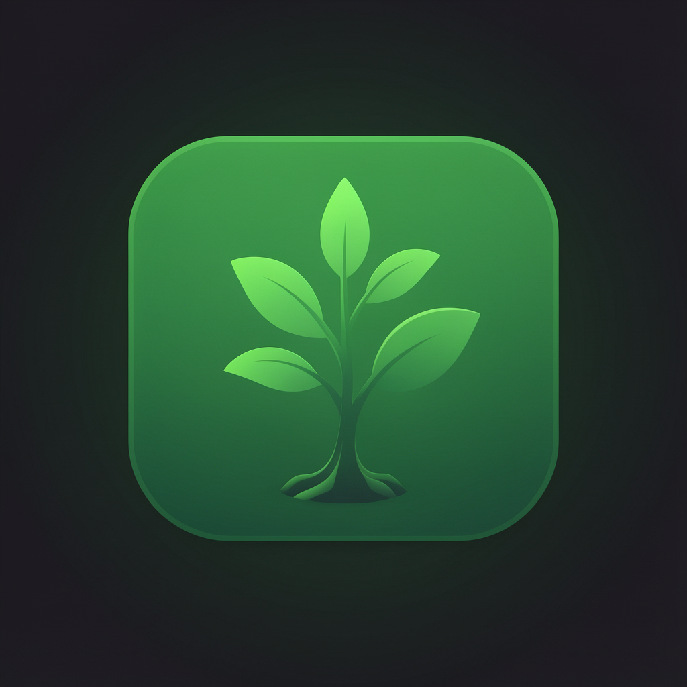
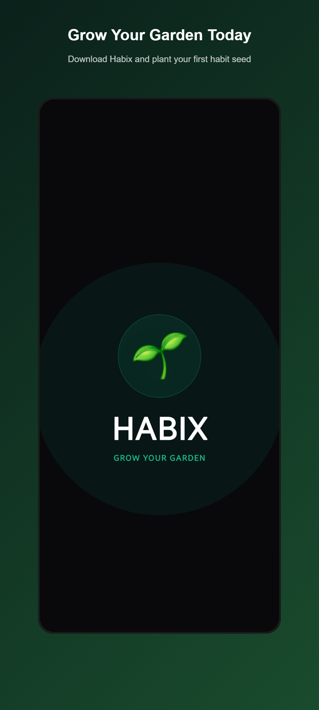
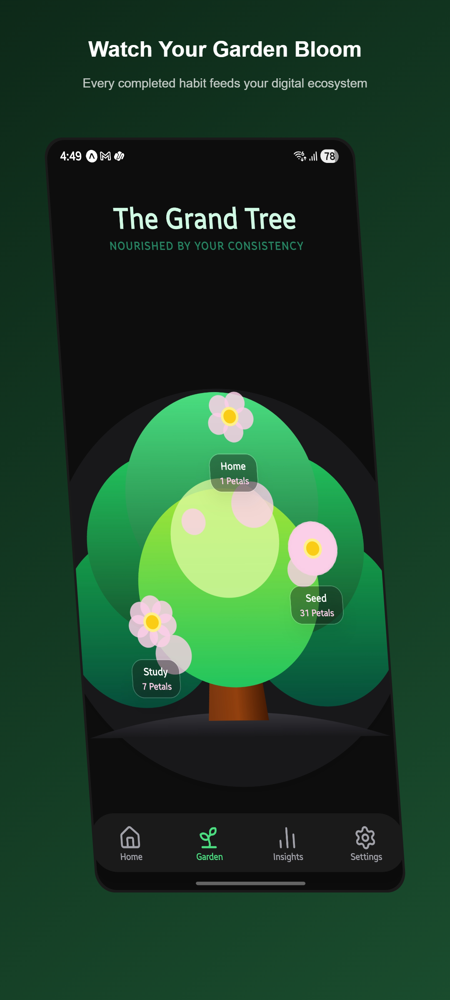
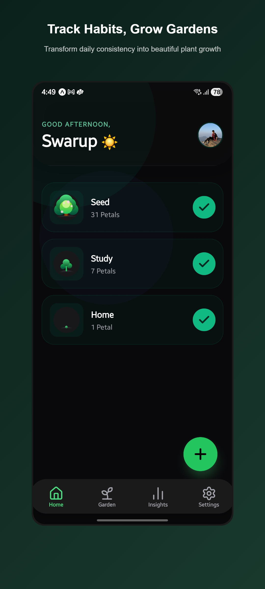
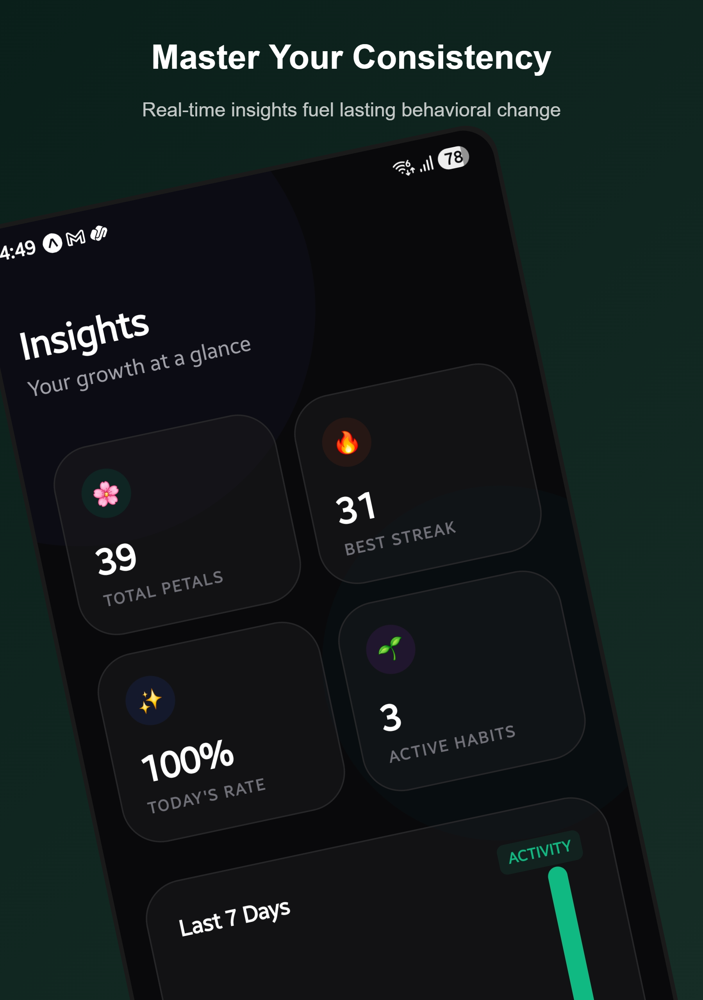
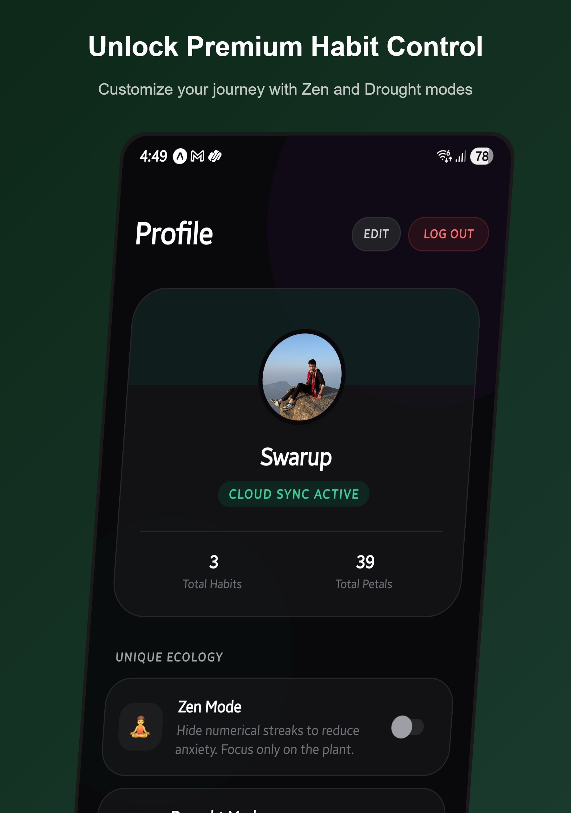

<div align="center">

  

# 🌿 Habix: Grow Your Garden

**Transform daily consistency into beautiful plant growth.**  
 _Where your real-world habits nurture a thriving digital ecosystem._

  <br/>

[](https://expo.dev/)
[](https://reactnative.dev/)
[](https://supabase.com/)
[](https://www.nativewind.dev/)

</div>

<br/>

## 🌌 The Ecosystem

Welcome to **Habix**, an aesthetically driven habit tracker designed to reduce anxiety and inspire consistency. Instead of focusing merely on rigid streaks and endless to-do lists, Habix visualizes your progress as a living, breathing **Grand Tree**. Every good habit you complete adds a petal, evolving your seed into a beautiful garden.

<p align="center">
  
  
  
  
  
</p>

---

## 🌟 Unique Features

- 🪴 **The Grand Tree**: Your digital pet that thrives on your discipline. Watch branches and petals grow in real-time as you tick off daily goals.
- 🧘‍♂️ **Zen Mode**: Hide numerical streaks to reduce habit-anxiety. Focus purely on the nature of your plant and behavioral change.
- 📊 **Beautiful Insights**: Elegantly crafted analytics showing your total petals, today's completion rate, best streaks, and weekly activity.
- ☁️ **Seamless Cloud Sync**: Powered by Supabase, your ecology is safeguarded. Start on one device, continue nurturing your tree on another.
- 🎨 **Aesthetic Dark Mode**: Specifically designed UI that leverages deep greens and charcoal blacks to create a mindful, grounding experience.

<br/>

## 🏗️ Technical Architecture

Habix is engineered using modern mobile development paradigms for blazing fast performance and smooth UI/UX:

- **Framework:** React Native + Expo Router (File-based navigation)
- **Styling:** NativeWind (Tailwind CSS for React Native)
- **State Management:** Zustand (Tiny, fast state management for `auth`, `habits`, and `profile`)
- **Backend:** Supabase (PostgreSQL, Auth, Realtime Sync)
- **Animations:** Lottie (for seamless plant visual loader)

<br/>

## 🚀 Getting Started

To run the Habix garden locally and begin contributing to the ecosystem, adhere to the following steps:

### 1. Clone the Repository

```bash
git clone https://github.com/swarupecenits/Habix.git
cd Habix
```

### 2. Install Dependencies

```bash
npm install
```

### 3. Environment Variables

Create a `.env` file at the root of the project and plug in your Supabase credentials:

```env
EXPO_PUBLIC_SUPABASE_URL=your_supabase_url
EXPO_PUBLIC_SUPABASE_ANON_KEY=your_supabase_anon_key
```

### 4. Start the Expo Server

```bash
npx expo start
```

_Press `a` to open Android, `i` to open iOS simulator, or scan the QR Code using the Expo Go app._

```bash
npx expo start
```

*Press `a` to open Android, `i` to open iOS simulator, or scan the QR Code using the Expo Go app.*

<br/>

## 📁 Repository Map

```text
Habix/
├── app/               # Expo Router pages (Screens: Home, Garden, Insights)
├── assets/            # App icons, splash screens, lush UI screenshots, Lottie files
├── components/        # Reusable UI components (HabitCard, PlantVisual, AuthModal)
├── constants/         # Theming variables and app-wide constants
├── store/             # Zustand stores (useAuthStore, useHabitStore, useProfileStore)
├── types/             # TypeScript interfaces and models
└── utils/             # Helper functions (Supabase client, Sync Service, Utils)
```

<br/>

---

<div align="center">
  <sub>Built with mindfulness by <a href="https://github.com/swarupecenits">swarupecenits</a>. Keep growing! 🍃</sub>
</div>
